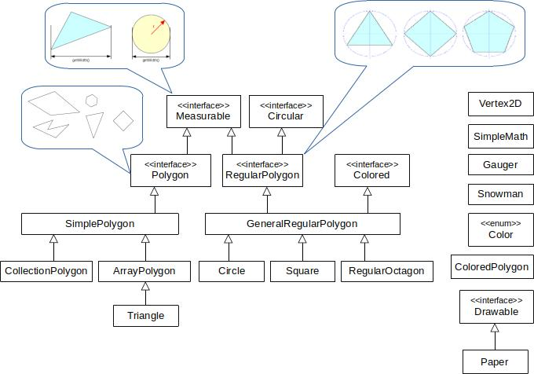

## Sedmá iterace

Cvičení zaměřené na práci s kolekcemi.

1.  Vytvořte třídu `CollectionPolygon` rozšiřující třídu `SimplePolygon`, která bude podobná třídě `ArrayPolygon`.
    Lišit se bude pouze tím, že vrcholy n-úhelníku nebudou uloženy v poli, ale ve vhodné kolekci.
	*   Vytvořte konstruktor, který jako vstupní parametr bude brát **pole** vrcholů 
	    (podobně jako tomu bylo u třídy `ArrayPolygon`). Vrcholy si ale uloží do vhodné kolekce.
    *   Stejně jako minule chceme zabránit tomu, aby vnikl polygon, který by neobsahoval žádný vrchol. 
	    Proto konstruktor zkontroluje, jestli není vstupní pole prázdné (null, prázdné, nebo samými null prvky).
		Pokud je prázdné, vyhodí opět konstruktor výjimku `IllegalArgumentException` s popisem.
    *   Definujte metody rovnosti.
        Dva polygony jsou stejné, pokud jsou všechny indexy vrcholů stejné,
        tj. mají stejné souřadnice vrcholů se stejným pořadím.
    *   Do třídy přidejte metodu `CollectionPolygon withoutLeftmostVertices()`,
        která vrátí nový polygon bez nejlevějších vrcholů (může jich být víc, viz např. obdélník).
        Původní polygon zůstane nezměněn. Pokud by nový polygon po odebrání nejlevějších vrcholů již žádné vrcholy 
		neobsahoval, metoda vrátí `null`.
		Pozn.: Tato metoda slouží k procvičení práce s kolekcemi. Žádný jiný smysl v ní nehledejte.
		
2.  Všimněte si, že konstruktory tříd `ArrayPolygon` a `CollectionPolygon` jsou si velmi podobné. 
    Oba kontrolují správnost vstupního pole. Liší se jen v uložení vrcholů.
	*   Ve společné nadtřídě `SimplePolygon` vytvoře konstruktor a přesuňte do něj společný kód.
	    Konstruktor `SimplePolygon` tedy zkontroluje správnost vstupního pole. V případě chyby
		vyhodí výjimku a tím celý proces vytváření polygonu skončí. Pokud je vše OK, předá se normálně řízení
		konstruktoru podtřídy. Konstruktory podtříd budou naopak volat konstruktor `SimplePolygon` a 
		poté si uloží vrcholy do pole respektive kolekce. 
		Pokud konstruktor `SimplePolygon` selže s výjimkou, selže automaticky i konstruktor podtřídy. 
		Nemusíte to tedy v podtřídách nijak ošetřovat. Podrobněji si práci s výjimkami procvičíme příště.
    *   Ve třídě `CollectionPolygon` vytvořte i druhý konstruktor, který bude brát jako parametr *seznam* vrcholů.
	    Opět se musí zkontrolovat, že máme alespoň jeden vrchol, takže i tento konstruktor bude volat 
		konstruktor nadtřídy vytvořený v předchozím bodě.

3. Vytvořte třídu `ColoredPolygon`, který vezme libovolný existující polygon a přidá mu novou vlastnost: barvu.
    *   Konstruktor bere polygon typu `Polygon` a barvu typu `Color`.
    *   Třída obsahuje gettery na dané atributy `getPolygon` a `getColor`.
    *   Dva barevné polygony jsou stejné, jestli obsahují (logicky) stejný polygon i barvu.

4.  Vytvořte třídu `Paper` implementující rozhraní `Drawable`.
    Tato třída simuluje papír, na který se dají kreslit barevné polygony. Simuluje ho v tom, že přímo
	nic nevykresluje, ale polygony, které se mají vykreslit, ukládá spolu s barvou do kolekce jako objekty `ColoredPolygon`.
	
    Když na papír nakreslíme stejný polygon (se stejnou barvou) dvakrát, uloží se jenom jednou.
    Na papír se kreslí barvou a každý polygon je pro jednoduchost jednobarevný.
    Implicitní barva je černá.
	
    *   První konstruktor bude bez parametrů.
    *   Další konstruktor bude brát parametr typu `Drawable` a kolekci nakreslených polygonů si zkopíruje.
    *   `changeColor(color)` změní barvu, jakou se budou následující polygony kreslit (s jakou barvou se budou ukládat)
	    Defaultní barva u nové instance papíru je černá. 
    *   `drawPolygon(polygon)` "namaluje" (tj. uloží) polygon na papír barvou nastavenou v předchozí metodě. 
	    Pokud by už takový polygon (stejné barvy a tvaru) na papíře (v kolekci) byl, tak se ignoruje.
	    Pokud je nastavená bílá barva polygon se nekreslí (neuloží), protože na bílém papíře by stejně nebyl vidět.
    *   `erasePolygon(polygon)` odstraní polygon z papíru (odebere z kolekce).
    *   `eraseAll()` odstraní všechny polygony z papíru.
    *   `getAllDrawnPolygons()` vrátí všechny barevné polygony.
    *   `uniqueVerticesAmount()` vrátí počet vrcholů na papíře bez duplicit.
    *   Více informací najdete v javadocu třídy `Drawable`.

5. Spuštění třídy `Draw`
[vykreslí barevný domeček](https://gitlab.fi.muni.cz/pb162/pb162-course-info/wikis/draw-images).

### Hinty

- Při výběru mezi seznamem a množinou v `CollectionPolygon` myslete na to, že topologie n-úhelníku je dána pořadím
  vrcholů a že je povoleno mít více vrcholů se stejnými souřadnicemi
  (u jednoduchého n-úhelníku se sice nesmí křížit hrany, mohou se ale dotýkat).
- Proměnné by měly být typu rozhraní, tj. `List` namísto `ArrayList`, `Set` namísto `HashSet`.
- Abstraktní třída `SimplePolygon` může mít konstruktor, nedá se však přímo instanciovat.
- Pro konverzi pole na seznam existuje statická metoda `Arrays.asList`.
- Pro konverzi kolekce na pole existuje metoda `toArray`, která bere jako argument nové pole.
- Kolekce z Java API mají nadefinovanou rovnost. A mají ji nadefinovanou rozumně. Využijte toho.
- Getter by neměl modifikovat daný atribut, proto vracejte kolekci jako **nemodifikovatelnou**.
  Tohle platí obecně, nejenom pro metodu `getAllDrawnPolygons()`!
  Nemodifikovatelné kolekce vytvoří statické metody `Collections.unmodifiableXXX`.
  Nemodifikovatelnou kolekci nemusíme vracet pouze v případě, kdy vytváříme kolekci přímo v dané metodě.
- Metody `List.of` i `Arrays.asList` vrací nemodifikovatelnou kolekci.
  Pro modifikaci je nutno vytvořit novou kolekci.
- Pozn.: Třída `ColoredPolygon` představuje mezikrok k tzv. návrhovému vzoru (design pattern) *Decorator*. 
  Ten přidává nové vlastnosti (zde barvu) k existujícímu objektu tak, že mezi klientský kód (`Paper`) a
  původní objekt (libovolný `Polygon`) vloží meziobjekt (`ColoredPolygon`). Aby to byl ale skutečný 
  dekorátor, musela by i třída `ColoredPolygon` implementovat rozhraní `Polygon`.

### Cílový UML diagram tříd:

